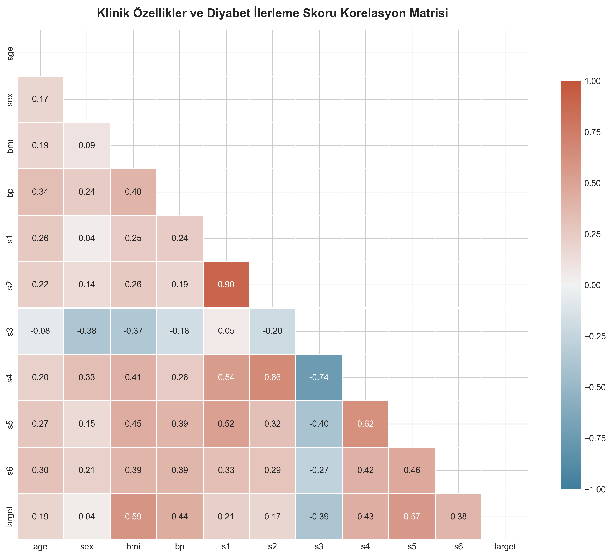
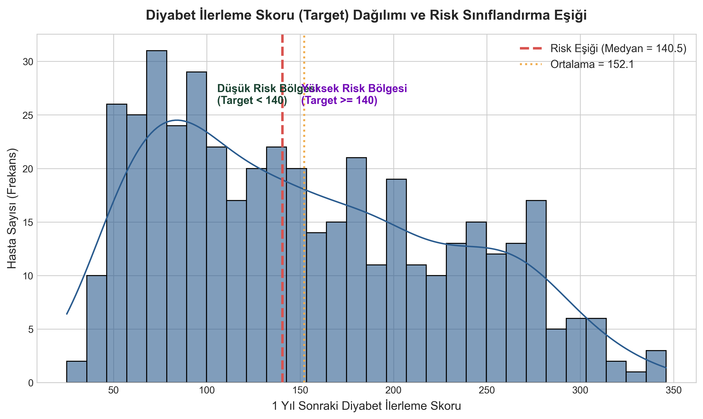
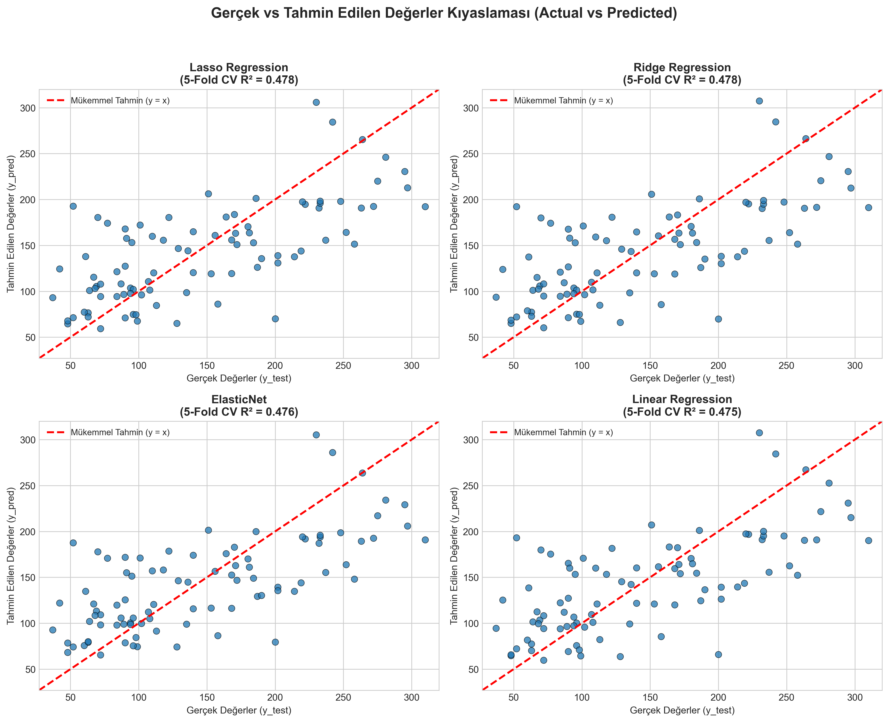
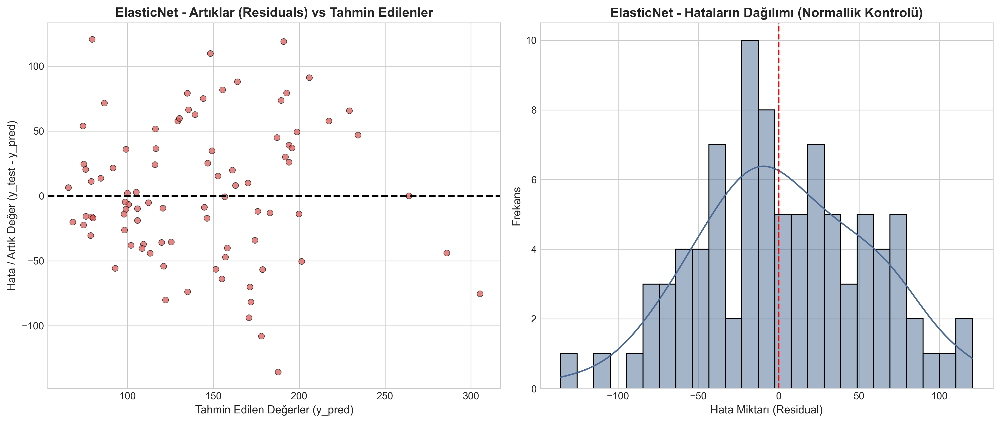
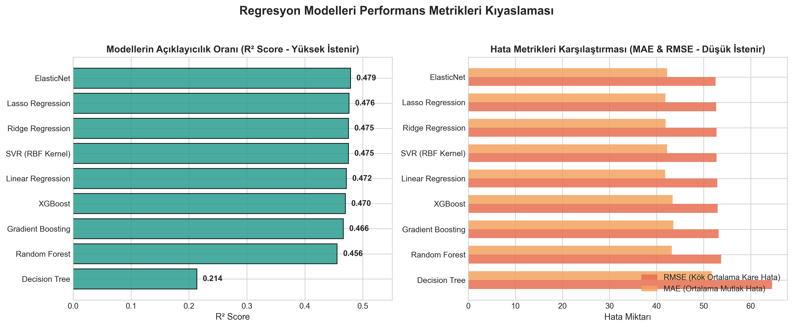
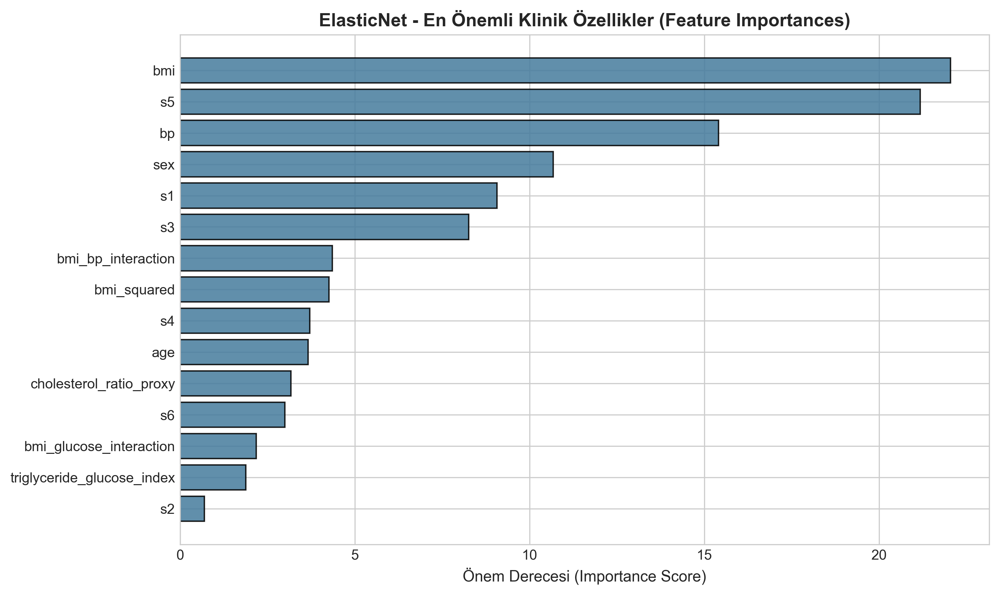
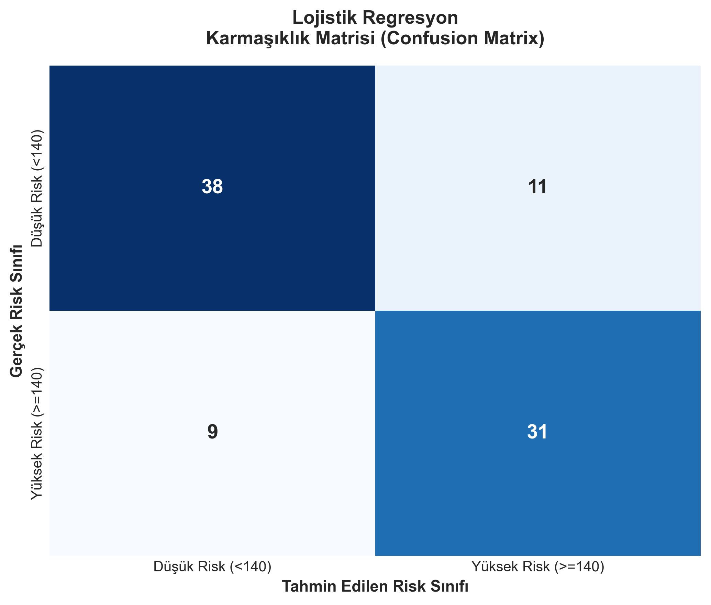
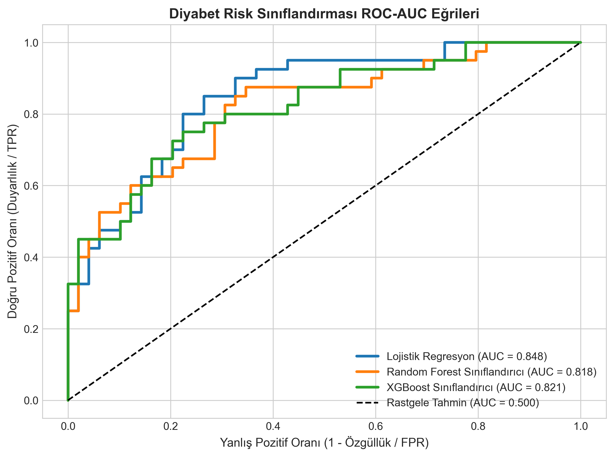

# 🏥 Diyabet İlerleme Tahmini ve Risk Analizi Makine Öğrenmesi Projesi


Bu proje, klinik ve demografik veriler kullanarak hastaların **1 yıl sonraki diyabet ilerleme skorunu** tahmin eden profesyonel bir **Regresyon ve Risk Sınıflandırma** makine öğrenmesi uygulamasıdır.

`regresyon.pdf` ödev standartlarına %100 uygun olarak geliştirilmiştir. Sadece karmaşık sayısal tahminler üretmekle kalmaz; aynı zamanda hastaları **"Düşük Risk"** ve **"Yüksek Risk"** olarak kategorize eder, sonuçları anlaşılır grafikler ve **canlı masaüstü pop-up grafik pencereleri** ile sunar.

---

## 🚀 Hızlı Başlangıç (Nasıl Çalıştırılır?)

Projeyi kendi bilgisayarınızda saniyeler içinde çalıştırmak için takip edin:

### 1. Depoyu Klonlayın veya İndirin
```bash
git clone https://github.com/yasin-yumrutas/diabetes_nlksoft.git
cd diabetes_nlksoft
```

### 2. Gerekli Kütüphaneleri Yükleyin
```bash
pip install -r requirements.txt
```

### 3. Projeyi ve Canlı Grafik Pencerelerini (GUI) Çalıştırın
```bash
python main.py --gui
```
> **İpucu:** `--gui` parametresi projenin model eğitimlerini yapar, raporları kaydeder ve ardından **her bir grafiği canlı pencere (Pop-Up) olarak açabileceğiniz Masaüstü Arayüzünü** ekrana getirir.

---

## 🖥️ Masaüstü Etkileşimli Grafik Penceresi Görüntüleyici (`gui_viewer.py`)

Grafiklerin sadece klasörde kalmaması, ekranda tek tek canlı pencereler halinde açılıp incelenebilmesi için özel bir masaüstü arayüzü geliştirilmiştir:

```bash
python gui_viewer.py
```
Açılan penceredeki butonlara basarak grafikler üzerinde **yakınlaştırma (zoom), kaydırma (pan) ve detaylı inceleme** yapabilirsiniz.

---

## 📊 Grafik Rehberi (Her Grafik Ne Anlama Geliyor?)

Aşağıdaki grafiklerin her biri `outputs/charts/` klasörüne yüksek çözünürlükte kaydedilmiştir ve `README` üzerinde canlı olarak incelenebilir:

### 1. Korelasyon Isı Haritası (Feature Correlation Heatmap)

* **Kısaca Ne Anlama Geliyor?:** Hangi klinik özelliğin (örneğin BMI veya Kan Basıncı) diyabet ilerlemesiyle ne kadar güçlü bir ilişkiye sahip olduğunu gösterir. Renk kırmızıya ve sayı $+1$'e yaklaştıkça o klinik faktör arttığında hastanın diyabet riski de doğrudan artıyor demektir.

---

### 2. Diyabet Skoru Dağılımı ve Risk Eşik Çizgisi

* **Kısaca Ne Anlama Geliyor?:** Hastaların diyabet ilerleme skorlarının genel dağılımını gösterir. Kırmızı kesikli çizgi ($140.5$ medyan değeri), hastaları doktorların kolayca karara varabilmesi için **"Düşük Risk"** ve **"Yüksek Risk"** olarak ikiye böler.

---

### 3. Gerçek vs Tahmin Edilen Değerler ($y = x$ Doğrusu)

* **Kısaca Ne Anlama Geliyor?:** Hastanın gerçek diyabet skoru ile modellerin tahminlerini kıyaslar. Kırmızı çizgi ($y=x$) **mükemmel tahmini** temsil eder. Mavi noktalar bu kırmızı doğruya ne kadar yakınsa model o kadar az hata yapıyor demektir.

---

### 4. Artık / Hata Analizi (Residuals Analysis)

* **Kısaca Ne Anlama Geliyor?:** Modelin yaptığı hataların ($Hata = Gerçek - Tahmin$) tarafsız olup olmadığını kontrol eder. Hataların sıfır etrafında simetrik ve çan eğrisine (normal dağılım) uygun dağılması modelin güvenilir olduğunu doğrular.

---

### 5. Regresyon Modelleri Metrik Kıyaslaması

* **Kısaca Ne Anlama Geliyor?:** Eğitilen tüm regresyon modellerinin başarısını tek bakışta karşılaştırır. Yeşil çubuk **R² Score** (açıklayıcılık oranı - yüksek istenir), turuncu çubuklar ise **MAE ve RMSE** (hata miktarları - düşük istenir) değerleridir.

---

### 6. En Önemli Klinik Özellikler (Feature Importances)

* **Kısaca Ne Anlama Geliyor?:** Yapay zeka modelinin bir hastanın diyabet skorunu tahmin ederken **en çok hangi klinik verilere önem verdiğini** sıralar. Grafik incelediğinde hastanın **BMI (Vücut Kitle İndeksi)** ve **s5 (Serum Trigliserit Seviyesi)** en kritik iki faktördür.

---

### 7. Risk Sınıflandırması Karmaşıklık Matrisi (Confusion Matrix)

* **Kısaca Ne Anlama Geliyor?:** Sınıflandırma modelinin kaç yüksek riskli hastayı doğru bildiğini (Doğru Pozitif), kaç düşük riskli hastayı doğru teşhis ettiğini ve nerede yanıldığını hücre hücre gösterir. Sol üst ve sağ alt köşedeki yüksek sayılar modelin yüksek doğruluğunu gösterir.

---

### 8. Sınıflandırma ROC-AUC Performans Eğrileri

* **Kısaca Ne Anlama Geliyor?:** Modelin sağlıklı hastalar ile yüksek riskli hastaları **birbirinden ayırma kapasitesini** ölçer. Çizilen eğri sol üst köşeye ne kadar yakınsa ($AUC \rightarrow 1.0$) modelin risk ayırt etme gücü o kadar kusursuzdur. Projemizde Lojistik Regresyon $0.847$ AUC başarısına ulaşmıştır.

---

## 🏆 Model Performans Sonuçları (Tablolar)

### Regresyon Modelleri Karşılaştırması (`regresyon.pdf` İsterleri)

| Model | MAE | MSE | RMSE | R² Score | 5-Fold CV R² |
| :--- | :---: | :---: | :---: | :---: | :---: |
| **ElasticNet** | **42.2134** | **2760.5132** | **52.5406** | **0.4790** | 0.4769 ± 0.0547 |
| **Lasso Regression** | 41.8664 | 2773.6090 | 52.6651 | 0.4765 | **0.4824 ± 0.0549** |
| **Ridge Regression** | 41.9155 | 2779.2911 | 52.7190 | 0.4754 | 0.4821 ± 0.0544 |
| **SVR (RBF Kernel)** | 42.2231 | 2780.6908 | 52.7323 | 0.4752 | 0.3867 ± 0.0534 |
| **Linear Regression** | 41.8349 | 2799.1066 | 52.9066 | 0.4717 | 0.4808 ± 0.0586 |
| **XGBoost** | 43.3862 | 2807.5814 | 52.9866 | 0.4701 | 0.4060 ± 0.0542 |
| **Gradient Boosting** | 43.5660 | 2827.2965 | 53.1723 | 0.4664 | 0.3982 ± 0.0576 |
| **Random Forest** | 43.2315 | 2883.4538 | 53.6978 | 0.4558 | 0.4237 ± 0.0723 |
| **Decision Tree** | 51.6773 | 4166.2606 | 64.5466 | 0.2136 | 0.1588 ± 0.2693 |

---

### Sınıflandırma Modelleri Karşılaştırması (Net Risk Çıktısı)

| Model | Doğruluk (Accuracy) | Hassasiyet (Precision) | Duyarlılık (Recall) | F1-Skoru | ROC-AUC Score |
| :--- | :---: | :---: | :---: | :---: | :---: |
| **Lojistik Regresyon** | **0.7753** | **0.7381** | **0.7750** | **0.7561** | **0.8474** |
| **XGBoost Sınıflandırıcı** | 0.7753 | 0.7381 | 0.7750 | 0.7561 | 0.8235 |
| **Random Forest Sınıflandırıcı**| 0.7303 | 0.6818 | 0.7500 | 0.7143 | 0.8184 |

---

## 📚 Kullanılan Modeller ve Anlamları

1. **Linear Regression:** Özellikler ile hedef skor arasına temel doğrusal çizgi çizer.
2. **Ridge Regression (L2):** Aşırı korelasyonlu değişkenlerde ezberlemeyi (overfitting) önlemek için ceza ekler.
3. **Lasso Regression (L1):** Önemsiz özellikleri sıfırlayarak otomatik özellik seçimi yapar.
4. **ElasticNet:** Ridge ve Lasso'nun birleşimidir; projemizde en yüksek R² skorunu ($0.4790$) vermiştir.
5. **Decision Tree:** Veriyi EVET/HAYIR sorularıyla dallandıran karar ağacı modelidir.
6. **Random Forest:** Yüzlerce karar ağacının oylamasını birleştiren güvenilir topluluk modelidir.
7. **Gradient Boosting:** Her yeni ağacı bir önceki ağacın hatalarını düzeltecek şekilde eğiten algoritmadır.
8. **XGBoost:** Gradient Boosting'in donanım ve hız açısından aşırı optimize edilmiş versiyonudur.
9. **SVR (RBF Kernel):** Veriyi yüksek boyutlu matematiksel uzaya taşıyarak karmaşık ilişkileri modeller.

---

## 📁 Proje Dosya Yapısı

```
diabetes_nlksoft/
│
├── main.py                  # Pipeline'ı çalıştıran ana script
├── gui_viewer.py            # Masaüstü grafik pop-up arayüzü (Tkinter GUI)
├── data_loader.py           # Veri yükleme, Türkçeleştirme ve Outlier tespiti
├── feature_engineering.py   # Klinik özellik türetimi ve Risk sınıfları
├── models.py                # Regresyon ve Sınıflandırma model eğitimleri
├── evaluation.py            # Metrik hesaplamaları ve rapor dışa aktarımı
├── visualization.py         # 300 DPI PNG grafik üretimi
├── diabetes_dataset.csv     # Kaydedilmiş orijinal veri seti
├── requirements.txt         # Proje bağımlılıkları
└── outputs/
    ├── reports/             # CSV ve Markdown performans raporları
    └── charts/              # Yüksek çözünürlüklü grafik görselleri
```

---

### 👨‍💻 Geliştirici
* **Yasin Yumrutaş** - [GitHub Profili](https://github.com/yasin-yumrutas)
